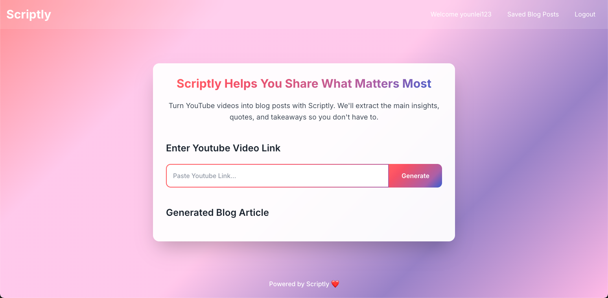
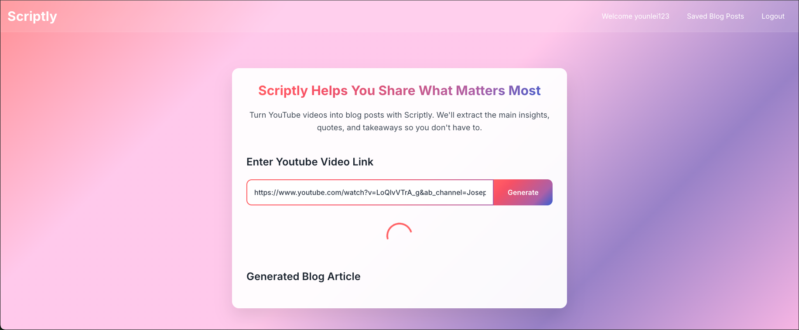
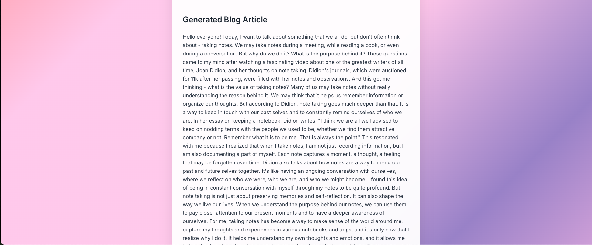

# Scriptly ✍️  
Turn YouTube videos into digestable posts—fast and easy.

Scriptly is a simple tool I built that lets you turn YouTube videos into natural, readable blog posts using AI. Just paste in a video link and get a full blog article—no typing, no transcribing, no stress.

---

## What it does  
- Paste a YouTube video link  
- It pulls the audio and transcribes it  
- AI rewrites it into a clean, conversational blog post  

---

## Features  
- One-click blog generation from any YouTube video  
- AI-generated content  
- Clean and minimal UI  
- Login system to save your posts (locally for now)  

---

## Tech stack  
**Frontend:**  
- HTML, TailwindCSS, JavaScript  

**Backend:**  
- Django (Python)  
- PostgreSQL

**Other tools:**  
- OpenAI (for blog writing)  
- AssemblyAI (for transcription)  
- yt-dlp (to handle YouTube videos)  

---

## How it works  
1. Paste a YouTube link  
2. Scriptly downloads and transcribes the video  
3. AI turns the transcript into a blog article  
4. You get a clean, readable post you can save or edit  

---

## Screenshots  
*Home screen:*  
  

*Video processing:*  
  

*Generated blog post:*  
  

---

## Notes  
This project is still local only—no deployment yet. But all the core features work!

---

